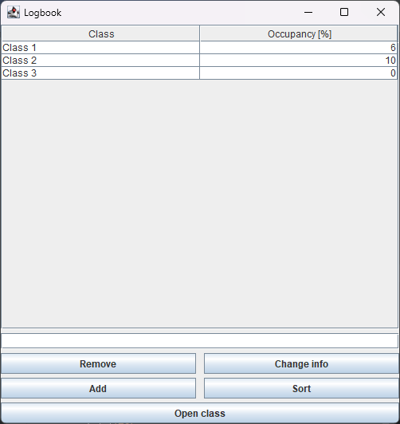
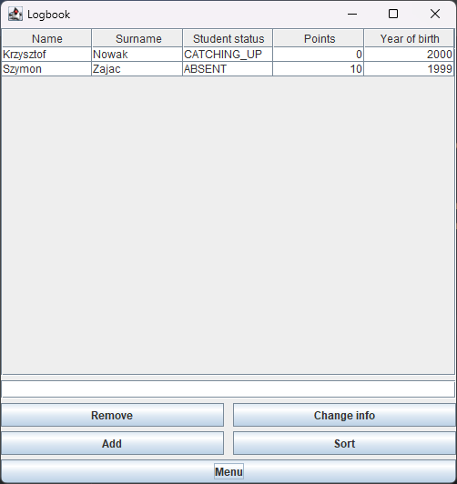

# School logbook
School logbook is a Java Swing based project.
It provides core functionalities for managing school groups.

### Main view
In main view, user can check list of available classes, sort them in descending order (by occupancy),
add and remove classes, change class info and open class info.
User can also filter classes by name using text box above buttons.

### Class view
In class view, user can check list of students enrolled in class, sort them in descending order
(by gathered points), change student's info and add or remove them.
User can also filter students by name using text box above buttons.

