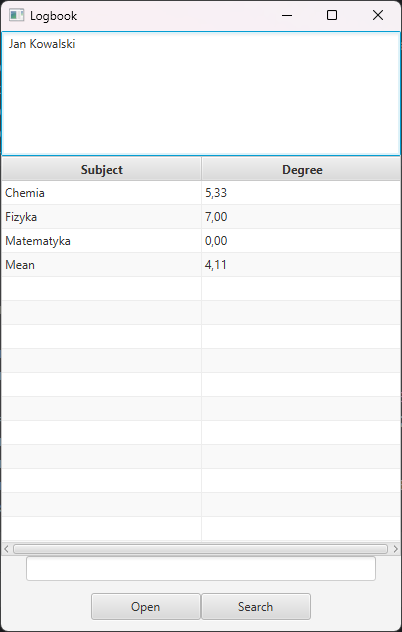
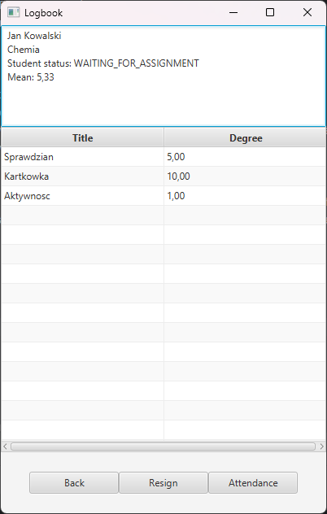
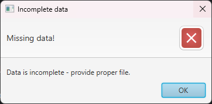
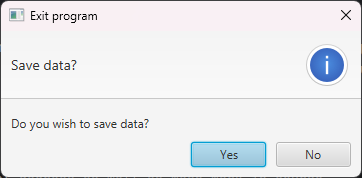

# School logbook v2
School logbook is a JavaFX based project.
It provides core functionalities for student-side activities,
such as checking classes, enrolling in classes, changing attendance and so on.

### Technologies
Project is a window application using JavaFX.
User interfaces were made in SceneBuilder.
Additionally, you can save state of the program using two independent mechanisms - 
Java Serialization or save to .csv (implemented with Reflection).

### Main view
On main screen, user can check their courses and degrees, with filtering them by name as well. 
User can access individual courses (Open button) and check available courses (Search button).

### Course view
Student can check individual degrees as well as mean mark in course.
On this screen, they can also resign from course or change their attendance status.

### Loading and saving data
On startup, program tries to load data from serialized file (or from .csv files, that can be changed in OverviewController).
If data is corrupted or the file is missing, error message is displayed and program leaves.

On exit, program asks user if they wish to save data to file (using serialization).

