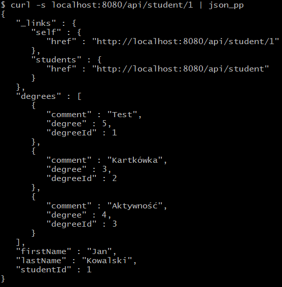
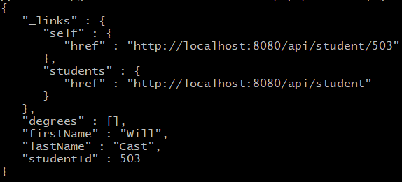
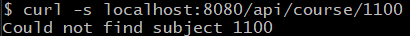

# School logbook v3
School logbook is a simple web service. It lets user check and upload data to school logbook.

### Technologies
Service with Rest API is driven by Spring Boot.
Data is saved in an H2 database (needs a standalone H2 database server).
Connection to database is managed with Hibernate.
Project uses Opencsv to generate .csv files.

### Supported operations
Service supports a handful of basic operations needed to run a school logbook.
Some operations are designed to be used by students, while others should be used by teachers only.
Operations return corresponding errors if provided data is incorrect.
If any data is needed, it should be .json format.

* Find student in database ```GET /api/student/{id}```
* Get student list ```GET /api/student```
* Check student's grade ```GET /api/student/{id}/grade```
* Generate .csv file of all students ```GET /api/student/csv```
* Add student to database ```POST /api/student```
* Remove student ```DELETE /api/student/{id}```
* Check class information ```GET /api/course/{id}```
* Get list of all subjects ```GET /api/course```
* Get list of students enrolled in a subject ```GET /api/course/{id}/students```
* Check course occupancy ```GET /api/course/{id}/fill```
* Add new subject ```POST /api/course```
* Remove a subject ```DELETE /api/course/{id}```
* Rate a course ```POST /api/rating```

### Examples
* Get student



* Add new student



* Get incorrect course

 